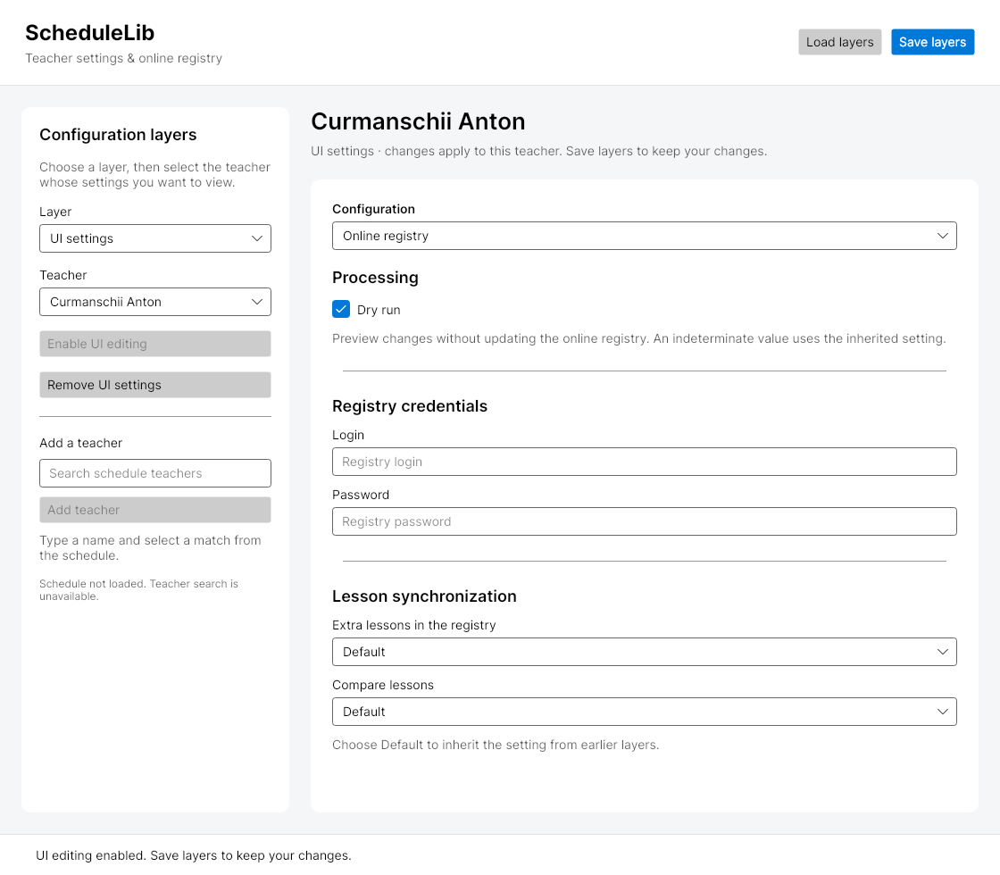

# Desktop configuration UI

The Avalonia desktop app turns the UI branch's layer/teacher/editor prototype into a configuration workspace. It follows the system light or dark theme and keeps navigation and the settings editor in independently scrollable panels.



[Dark theme preview](docs/desktop-ui-dark.png)

These previews render the actual Avalonia views with a configured teacher and UI editing enabled. Schedule loading is skipped in the preview, so the teacher-search status says the schedule is not loaded.

## Workflow

1. Select **Application defaults**, **Configured teachers**, or **UI settings**. The first two layers are read only.
2. Select a configured teacher and click **Enable UI editing**, or search for a teacher from the loaded schedule and click **Add teacher**.
3. Edit the online registry's processing, credentials, and lesson synchronization settings. **Default** resets a selection to inheritance; the indeterminate **Dry run** state removes the local command-processing override.
4. Click **Save layers** to write `ui-layers.json` in the working directory. **Load layers** reads that file and applies the saved layers. Missing files and errors appear in the status bar.
5. **Remove UI settings** removes the selected teacher's UI layer. Save afterwards to persist the removal.

The screen configures the existing registry integration. It does not execute registry synchronization. The schedule's loading/error state is shown below teacher search; configured teachers can still be selected if loading fails.

## Editor integration

`RegistryEditorFactory` uses the existing `VmFactoryBuilder`, `NodeDataAccessor`, and `NodeDataVmHost` to construct the registry editor and update it when selection changes. The configuration selector uses the factory's shared key and selects the editor at startup. The experimental generic property-set builders remain separate from this working registration.

The main view model owns and disposes its child view models. Editor hosts dispose their inner view model and accessor. Credential getters preserve inherited credential sources and only create explicit credentials on an editable write.

## Run and validate

The repository targets .NET 11 and Windows. With the matching SDK installed:

```sh
dotnet build src/Gui/Desktop/Desktop.csproj
dotnet test src/Gui/Tests/Desktop/Desktop.Tests.csproj
```

Run `Desktop.dll` from its build output directory with the schedule data/configuration required by the existing integration. Password fields are masked in the UI; saved UI layers use the existing JSON serializer.

For this change, the available SDK was .NET 10.0.401. Validation used an isolated repository copy with only `Directory.Build.props` changed from `net11.0` to `net10.0`, leaving the committed target unchanged:

```sh
dotnet test src/Gui/Tests/Desktop/Desktop.Tests.csproj -p:EnableWindowsTargeting=true -p:NuGetAudit=false
```

All 22 desktop tests passed. `NuGetAudit=false` bypassed an existing AngleSharp 1.2.0 advisory that otherwise fails restore under the repository's warnings-as-errors policy. Light and dark screenshots were rendered through Avalonia Headless and Skia. The native .NET 11 build and live schedule/registry integrations were not exercised in this environment.
